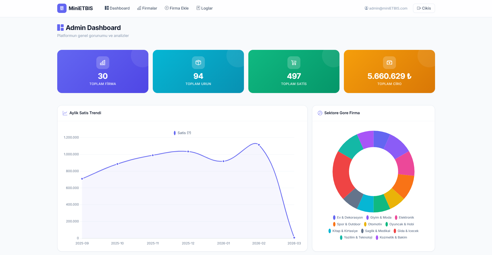
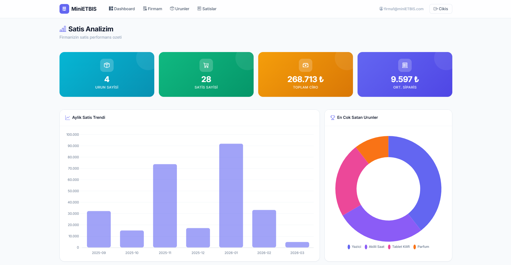
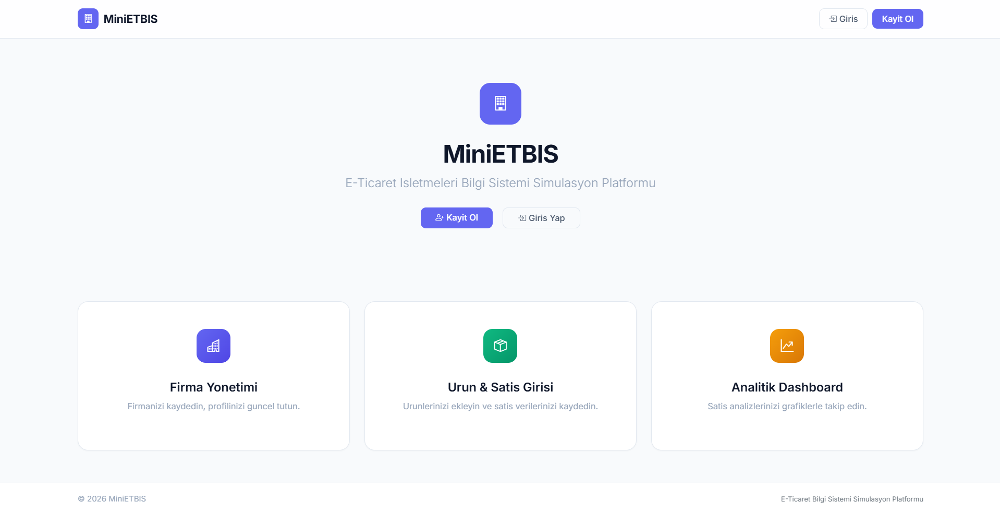
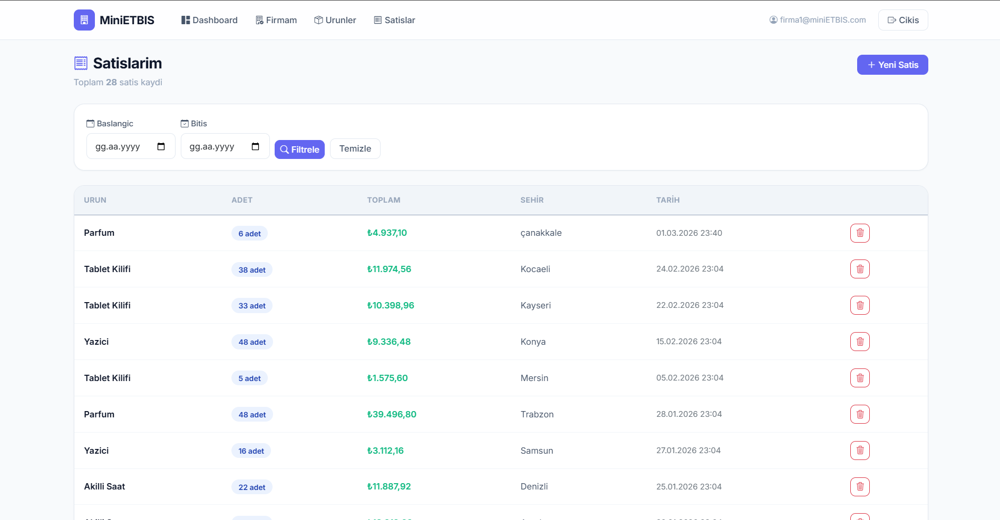
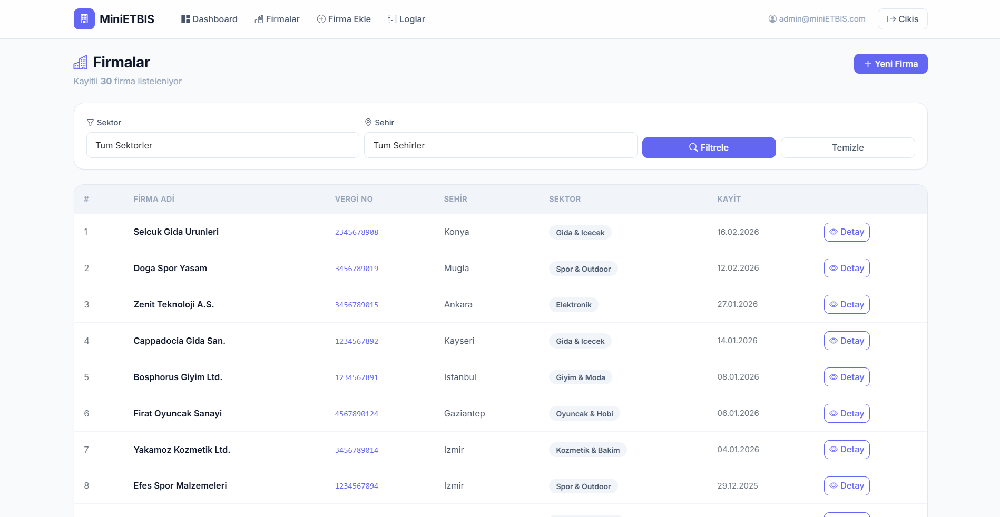

# Mini ETBİS Simulation Platform

ASP.NET Core MVC based e-commerce regulatory data collection and analytics system inspired by public regulatory platforms.

## 🚀 Project Overview
Mini ETBİS Simulation Platform is a role-based e-commerce data reporting and analytics system that simulates a public regulatory infrastructure.
The system collects company and sales data, processes it, and generates analytical insights via dashboard visualizations.

## 🏗 Architecture
- ASP.NET Core 8 MVC
- Entity Framework Core (Code First)
- PostgreSQL
- Layered Architecture
- Repository Pattern
- Role-Based Authorization

## 📊 Features
- Company registration system
- Sales data management
- Role-based authentication (Admin / Company)
- Analytics dashboard
- KPI calculations
- CSV export
- Audit logging
- Indexed and optimized queries

## 📈 Dashboard Analytics
- Monthly sales trends
- City-based sales distribution
- Sector-based company statistics
- Top selling products
- Growth rate analysis

## 🗄 Database Design
- Normalized relational schema
- Indexed high-frequency query columns
- Optimized read operations using AsNoTracking()

## 🔐 Security
- ASP.NET Identity
- Role-based authorization
- Anti-forgery protection
- Input validation
- SQL Injection protection (EF Core)

## ⚡ Performance Considerations
- Indexed columns for reporting
- DTO projection for query optimization
- Pagination
- Lazy loading disabled
- Efficient LINQ queries

## 🛠 Tech Stack
- ASP.NET Core MVC
- EF Core
- PostgreSQL
- Bootstrap
- Chart.js

## 📸 Screenshots
### Dashboard


### Login

### Sales Panel

### Company


## 🚀 Setup Instructions
```bash
git clone https://github.com/yourusername/mini-etbis-simulation-mvc.git
cd mini-etbis-simulation-mvc
dotnet restore
dotnet ef database update
dotnet run
